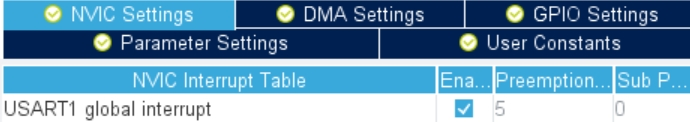

В даній статті ми розглянемо можливість відображення даних із порта uart на дисплеї плати stm32f429, для цього будемо використовувати графічний фреймворк touchFGX
та rfid модуль RDM6300.
<!-- end -->

## Для початку відкриємо touchGFX Designer створимо новий проект. Додамо текстове поле textArea1. Далі для нього додамо wildcard і виставимо розмір буфера 15 байт.


В налаштуваннях тексту виставимо: wildcard ranges: 0x20-0x7E

## Відкриваємо CubeMX. Вмикаємо UART1 в асинхронному режимі. Виставляємо швидкість 9600.


Та дозволяємо глобальні переривання.



## В налаштуваннях freeRTOS створимо нове завдання та бінарний семафор.


## Зберігаємо та генеруємо код.

## Відкриваємо CubeIDE, добавимо заголовочний файл rfid.h, в якому пропишемо розмір буферу та байти старту і кінця повідомлення.

```c
#define UART_BUF_SIZE 16
#define START_MSG 0x20
#define END_MSG 0x03
```
## Оголошуємо буфер для повідомлень uartMsgBuf і масив прийом байта uartMsgData та інші флаги.

```c
uint8_t uartMsgBuf[UART_BUF_SIZE];
uint8_t uartMsgData[2];
uint8_t msgIndex = 0;
uint8_t msgRdyFlag = 0;
uint8_t startRecive = 0;
```

## Знаходимо наше задачу startUartMsg та дозволяємо переривання від uart.

```c
HAL_UART_Receive_IT(&huart1, uartMsgData, 1);
```

### В коллбек функції HAL_UART_RxCpltCallback ми отримуємо байти від uart інтерфейса, шукаємо символ старту повідомлення, далі наповнюємо буфер uartMsgBuf поки не отримаємо символ закінчення повідомлення. Якщо отримали - тоді обнуляємо індекс буферу та виставляємо флаг msgRdyFlag, він означає, що ми отримали повідомлення.

```c
void HAL_UART_RxCpltCallback(UART_HandleTypeDef *huart)
{
	if(msgIndex == 0)
	{
		memset(&uartMsgBuf, 0, sizeof(uartMsgBuf));
	}

	if(uartMsgData[0] == START_MSG) { startRecive = 1; }

	if(uartMsgData[0] != END_MSG && startRecive == 1 )
	{
		uartMsgBuf[msgIndex++] = uartMsgData[0];
	}
	else
	{
		msgIndex = 0;
		msgRdyFlag = 1;
		startRecive = 0;
	}

	HAL_UART_Receive_IT(&huart1, uartMsgData, 1);

}
```

### В основному циклі задачі ми перевіряємо статус msgRdyFlag. Якщо повідомлення прийшло (msgRdyFlag=1), тоді виставляємо семафор binarySemUartHandle та обнуляємо флаг прийому повідомлення (msgRdyFlag=0).

```c
void startUartMsg(void *argument)
{
  /* USER CODE BEGIN startUartMsg */
	HAL_UART_Receive_IT(&huart1, uartMsgData, 1);
  /* Infinite loop */
  for(;;)
  {
	  if(msgRdyFlag)
	  	{
	  		osSemaphoreRelease(binarySemUartHandle);
	  		msgRdyFlag = 0;
	  	}
    osDelay(1);
  }
  /* USER CODE END startUartMsg */
}
```
### Переходимо в нашу модель. Спочатку розширимо наш семафор, щоб він був нам тут доступним

```c
extern osSemaphoreId_t binarySemUartHandle;
```
### Далі в методі моделі tick(), ми очікуєм на семафор, якщо він є - тоді викликаємо функцію uartMsgRdy().

```c
void Model::tick()
{
	if(binarySemUartHandle != NULL)
	{
		if(osSemaphoreAcquire(binarySemUartHandle, 100 ) == osOK)
		{
			uartMsgRdy();
		}
	}
}
```
Добавимо прототип void uartMsgRdy(); у файлі model.hpp

### Додамо у презентер Screen1Presenter.cpp код:

```c
void Screen1Presenter::uartMsgRdy()
{
	view.uartMsgRdy();
}
```

### Додамо у презентер Screen1Presenter.cpp код:

```c
void Screen1Presenter::uartMsgRdy()
{
	view.uartMsgRdy();
}
```
Добавимо прототип virtual void uartMsgRdy(); у файлі Screen1Presenter.hpp 

### У нашому view створимо метод uartMsgRdy, в якому виведемо наш буфер uartMsgBuf в текстове поле textArea1 на нашому дисплеї.

```c
void Screen1View::uartMsgRdy()
{
	if(uartMsgBuf[0] == 0) return;

	for (int i=0; i<UART_BUF_SIZE -1; i++) viewBuf[i]=uartMsgBuf[i+1];

	memset(&textArea1Buffer, 0, TEXTAREA1_SIZE);
	Unicode::strncpy(textArea1Buffer, (char*)viewBuf, TEXTAREA1_SIZE - 1 );
	textArea1Buffer[16] = '\0';
	textArea1.invalidate();
}
```
Також підключимо загаловочний файл та розширимо наш буфер в поле видимості файлу.
Добавимо прототип virtual void uartMsgRdy(); у файлі ScreenView.hpp 
```c
#include "rfid.h"
extern uint8_t uartMsgBuf[UART_BUF_SIZE];
```

