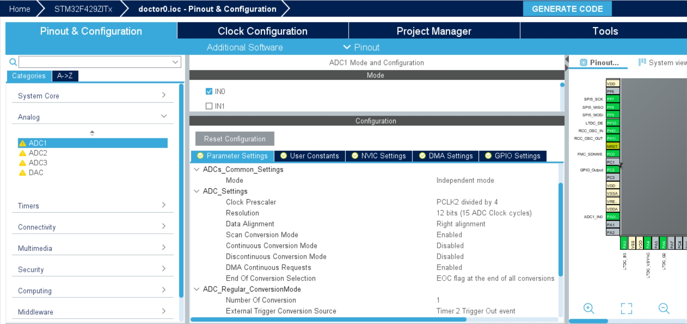
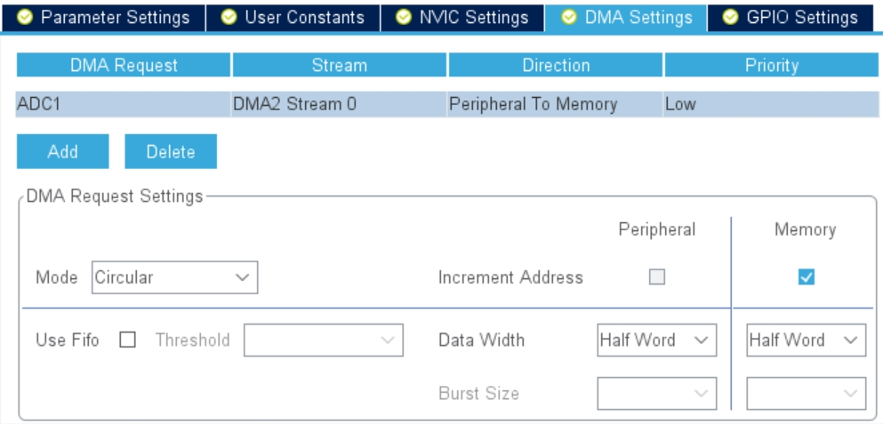
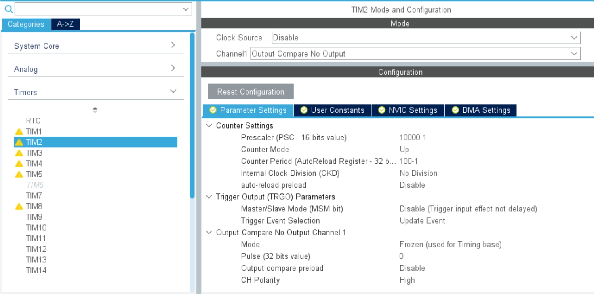

Welcome to the future, I hope you enjoy your stay! This is an example of how you can control what excerpt shows up.

<!-- end -->

## Активуємо аналого-цифровий перетворювач ADC1, канал IN0, фізично це 34 пін мікроконтроллера



Виставимо такі параметри роботи АЦП:
1.  Scan conversion mode - Enabled
2.  DMA Continuous Requests - Enabled
3.  End of Conversion Selection - EOC flag at the end of all conversions
4.  External Trigger Conversion Sourse - Timer 2 Trigger Out event 

## Вмикаємо DMA (Mode: Circular)



## Активуємо таймер TIM2, channel1 - output compare no output
Виставимо такі параметри роботи TIM2:
1.  Prescaler - 10000-1
2.  Counter Period  - 100-1
3.  Trigger event selection - Update Event



## Налаштуємо freeRTOS
1.  Створимо задачу taskAnalogInput
2.  Створимо бінарний семафор binarySemAnalog 


## Згенеруємо код CubeMX

## Виносимо код за межі  main.c наприклад у файл analog.c

```c
#include <analog.h>
#include "main.h"
#include "cmsis_os.h"

extern ADC_HandleTypeDef hadc1;
extern TIM_HandleTypeDef htim2;
extern osSemaphoreId_t binarySemAnalogHandle;

uint16_t uhADCxConvertedValue[10] = {0};

void PollingInit()
{
	HAL_ADC_Start_DMA(&hadc1, &uhADCxConvertedValue, 10);
	HAL_TIM_Base_Start_IT(&htim2);
}

void HAL_ADC_ConvCpltCallback(ADC_HandleTypeDef* hadc)
{
	osSemaphoreRelease(binarySemAnalogHandle);
}
```

## Також створимо файл заголовок analog.h в якому пропишемо прототипи функцій

```c
#ifndef INC_ANALOG_H_
#define INC_ANALOG_H_

void PollingInit();

#endif /* INC_ANALOG_H_ */
```

## Добавимо нашу функції ініціалізації в завдання StartTaskAnalogInput у файлі main.c

```c
/* USER CODE END Header_StartTaskAnalogInput */
void StartTaskAnalogInput(void *argument)
{
  /* USER CODE BEGIN StartTaskAnalogInput */
	PollingInit();
  /* Infinite loop */
  for(;;)
  {
    osDelay(1);
  }
  /* USER CODE END StartTaskAnalogInput */
}
```
 
## Код для model.cpp (не забуваємо додати прототип функії в model.hpp)

```c
#include <gui/model/Model.hpp>
#include <gui/model/ModelListener.hpp>
#include <cmsis_os2.h>

extern osSemaphoreId_t binarySemAnalogHandle;
extern uint16_t uhADCxConvertedValue[10];

Model::Model() : modelListener(0)
{

}

void Model::tick()
{
	if(binarySemAnalogHandle != NULL)
	{
		if(osSemaphoreAcquire(binarySemAnalogHandle, 100) == osOK)
		{
			analogUpdate();
		}
	}

}

void Model::analogUpdate()
{
	uint32_t sum = 0;
	for(int i = 0; i < 10; i++)
	{
		sum += uhADCxConvertedValue[i];
	}
	modelListener->analogUpdate(sum / 10);
}
```

## Додамо у презентер Screen1Presenter.cpp код:

```
void Screen1Presenter::analogUpdate(uint32_t value)
{
	view.analogUpdate(value);
}
```

## Додамо публічний віртуальний метод у файлі Screen1Presenter.hpp:

```
virtual void analogUpdate(uint32_t value);
```

## Додамо у Screen1View.cpp функцію:

```
void Screen1View::analogUpdate(uint32_t value)
{
	memset(&textAreaADBuffer, 0, TEXTAREAAD_SIZE);
	Unicode::snprintfFloat(textAreaADBuffer, sizeof(textAreaADBuffer), "%.3f", value * 0.000805664 ); // 3.3/4096 = 0.000805664
	textAreaAD.invalidate();
}
```

## Screen1View.hpp додамо віртуальний метод:

```
#ifndef SCREEN1VIEW_HPP
#define SCREEN1VIEW_HPP

#include <gui_generated/screen1_screen/Screen1ViewBase.hpp>
#include <gui/screen1_screen/Screen1Presenter.hpp>

class Screen1View : public Screen1ViewBase
{
public:
    Screen1View();
    virtual ~Screen1View() {}
    virtual void setupScreen();
    virtual void tearDownScreen();
    virtual void analogUpdate(uint32_t value);
protected:
};

#endif // SCREEN1VIEW_HPP 
```

Nam ullamcorper, orci nec tempor hendrerit, lorem nunc laoreet diam, vel gravida sem mi quis augue. Nunc odio velit, facilisis quis dictum non, facilisis quis felis. Vivamus [elementum dapibus nibh](https://google.com), eget aliquet nunc luctus maximus. Sed finibus risus eget ultrices maximus. Aliquam commodo consectetur diam eget tristique. Nunc quis erat quis felis fringilla tempus. Cras tempor nibh dolor, ac lacinia lacus ultrices eu.

> Quisque tempor nulla turpis, ut placerat arcu lobortis nec. Aenean sed vehicula nisi. Nullam vitae placerat enim. Etiam hendrerit enim vel tempor fermentum. Morbi rutrum euismod ipsum a luctus.

Morbi et libero id metus tempor imperdiet eget non mi. Mauris pulvinar quis enim at placerat. Vestibulum vitae dapibus lectus, ut elementum est.

### Pellentesque facilisis venenatis mi, sit amet molestie nisl ornare et

Morbi posuere facilisis eros vel euismod. Pellentesque habitant morbi tristique senectus et netus et malesuada fames ac turpis egestas. Etiam malesuada dapibus dolor non cursus. Sed in turpis justo. Cras sed hendrerit nulla. Sed ornare, leo et suscipit tincidunt, justo diam sollicitudin risus, vitae vulputate nulla augue et lacus.

1.  Morbi posuere facilisis
2.  Pellentesque habitant morbi tristique
3.  Etiam malesuada dapibus

Ut vel ligula ante. Proin quis metus magna. Nulla nec dui vulputate, semper orci in, sagittis dolor. Mauris dictum neque non fermentum consectetur. Integer vel pellentesque ex, ut tincidunt quam.

#### Sed ac orci a dolor venenatis vulputate

Sed sollicitudin, turpis ac malesuada dapibus, magna dui semper orci, in congue justo felis quis ante. Phasellus consequat et dolor fringilla accumsan. Pellentesque ullamcorper porttitor dolor et imperdiet.


Pellentesque consectetur facilisis venenatis. Nam ullamcorper, orci nec tempor hendrerit, lorem nunc laoreet diam, vel gravida sem mi quis augue. Nunc odio velit, facilisis quis dictum non, facilisis quis felis. Vivamus elementum dapibus nibh, eget aliquet nunc luctus maximus. Sed finibus risus eget ultrices maximus. Aliquam commodo consectetur diam eget tristique. Nunc quis erat quis felis fringilla tempus. Cras tempor nibh dolor, ac lacinia lacus ultrices eu.

##### Nulla nec dui vulputate, semper orci in, sagittis dolor

Mauris dictum neque non fermentum consectetur. Integer vel pellentesque ex, ut tincidunt quam. Sed ac orci a dolor venenatis vulputate. Sed sollicitudin, turpis ac malesuada dapibus, magna dui semper orci, in congue justo felis quis ante. Phasellus consequat et dolor fringilla accumsan. Pellentesque ullamcorper porttitor dolor et imperdiet.

```javascript
$(document).ready(function() {
    console.log('More jQuery, wow!')
})
```

###### ras aliquet ipsum ut enim pellentesque, id varius quam placerat

Maecenas non scelerisque leo. Sed id purus fringilla, consequat magna non, faucibus neque. Cras ornare nisi a lectus ultricies convallis. Integer tristique dictum eros, et elementum ante consectetur eget. Phasellus sollicitudin est vestibulum suscipit pellentesque. Duis in eros cursus magna laoreet aliquam vel a lectus. Nulla ut nisi vitae ipsum sollicitudin vestibulum. Aenean sit amet mattis odio. Vestibulum ultrices sed ipsum nec pretium. Integer non turpis nunc. Praesent tincidunt tincidunt alique

Integer mollis dolor non libero placerat, ut efficitur nisi ultricies. Etiam ac lacinia urna, eget ornare nunc. Suspendisse eget eros id turpis gravida semper. Duis ornare lorem et est pellentesque, quis rhoncus leo vestibulum. Nullam eu nulla ut elit rutrum iaculis. Cras a laoreet elit, in aliquet erat. Sed interdum varius posuere. Pellentesque eget luctus erat. Nam quis sem in ligula efficitur bibendum.
