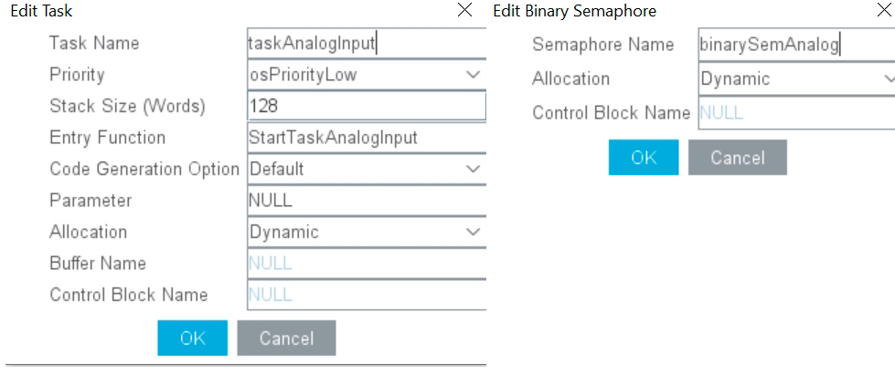

В даній статті буде розглянуто приклад роботи з аналого-цифровим перетворювачем та tft-дисплеєм, за допомогою графічної бібліотеки touchGFX та операційної системи реального часу freeRTOS.

<!-- end -->

## Активуємо аналого-цифровий перетворювач ADC1, канал IN0, фізично це 34 пін мікроконтроллера


Виставимо такі параметри роботи АЦП:
1.  Scan conversion mode - Enabled
2.  DMA Continuous Requests - Enabled
3.  End of Conversion Selection - EOC flag at the end of all conversions
4.  External Trigger Conversion Sourse - Timer 2 Trigger Out event 

## Вмикаємо DMA (Mode: Circular)


## Активуємо таймер TIM2, channel1 - output compare no output
Виставимо такі параметри роботи TIM2:
1.  Prescaler - 10000-1
2.  Counter Period  - 100-1
3.  Trigger event selection - Update Event


## Налаштуємо freeRTOS
1.  Створимо задачу taskAnalogInput
2.  Створимо бінарний семафор binarySemAnalog 



## Згенеруємо код CubeMX

## Створимо в TouchGFX Designer проект, добавимо текстове поле та фонове фото

 

## Відкриваєм проект в CubeIDE та виносимо код за межі main.c наприклад у файл analog.c

```c
#include <analog.h>
#include "main.h"
#include "cmsis_os.h"

extern ADC_HandleTypeDef hadc1;
extern TIM_HandleTypeDef htim2;
extern osSemaphoreId_t binarySemAnalogHandle;

uint16_t uhADCxConvertedValue[10] = {0};

void PollingInit()
{
	HAL_ADC_Start_DMA(&hadc1, &uhADCxConvertedValue, 10);
	HAL_TIM_Base_Start_IT(&htim2);
}

void HAL_ADC_ConvCpltCallback(ADC_HandleTypeDef* hadc)
{
	osSemaphoreRelease(binarySemAnalogHandle);
}
```

## Також створимо файл заголовок analog.h в якому пропишемо прототипи функцій

```c
#ifndef INC_ANALOG_H_
#define INC_ANALOG_H_

void PollingInit();

#endif /* INC_ANALOG_H_ */
```

## Добавимо нашу функції ініціалізації в завдання StartTaskAnalogInput у файлі main.c

```c
/* USER CODE END Header_StartTaskAnalogInput */
void StartTaskAnalogInput(void *argument)
{
  /* USER CODE BEGIN StartTaskAnalogInput */
	PollingInit();
  /* Infinite loop */
  for(;;)
  {
    osDelay(1);
  }
  /* USER CODE END StartTaskAnalogInput */
}
```
 
## Код для model.cpp (не забуваємо додати прототип функії в model.hpp)

```c
#include <gui/model/Model.hpp>
#include <gui/model/ModelListener.hpp>
#include <cmsis_os2.h>

extern osSemaphoreId_t binarySemAnalogHandle;
extern uint16_t uhADCxConvertedValue[10];

Model::Model() : modelListener(0)
{

}

void Model::tick()
{
	if(binarySemAnalogHandle != NULL)
	{
		if(osSemaphoreAcquire(binarySemAnalogHandle, 100) == osOK)
		{
			analogUpdate();
		}
	}

}

void Model::analogUpdate()
{
	uint32_t sum = 0;
	for(int i = 0; i < 10; i++)
	{
		sum += uhADCxConvertedValue[i];
	}
	modelListener->analogUpdate(sum / 10);
}
```

## Додамо у презентер Screen1Presenter.cpp код:

```c
void Screen1Presenter::analogUpdate(uint32_t value)
{
	view.analogUpdate(value);
}
```

## Додамо публічний віртуальний метод у файлі Screen1Presenter.hpp:

```c
virtual void analogUpdate(uint32_t value);
```

## Додамо у Screen1View.cpp функцію:

```c
void Screen1View::analogUpdate(uint32_t value)
{
	memset(&textAreaADBuffer, 0, TEXTAREAAD_SIZE);
	Unicode::snprintfFloat(textAreaADBuffer, sizeof(textAreaADBuffer), "%.3f", value * 0.000805664 ); // 3.3/4096 = 0.000805664
	textAreaAD.invalidate();
}
```

## Screen1View.hpp додамо віртуальний метод:

```c
#ifndef SCREEN1VIEW_HPP
#define SCREEN1VIEW_HPP

#include <gui_generated/screen1_screen/Screen1ViewBase.hpp>
#include <gui/screen1_screen/Screen1Presenter.hpp>

class Screen1View : public Screen1ViewBase
{
public:
    Screen1View();
    virtual ~Screen1View() {}
    virtual void setupScreen();
    virtual void tearDownScreen();
    virtual void analogUpdate(uint32_t value);
protected:
};

#endif // SCREEN1VIEW_HPP 
```

## Компілюємо код та заливаємо у контролер

## Демонстраційне відео:

[](http://www.youtube.com/watch?v=mUPyw4Spywk "STM32f429 + freeRTOS + touchGFX ")

### Код на Github](https://github.com/Dimancheltv/touchgfx-adc)


