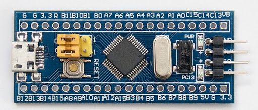

В даній статті буде розглянуто приклад роботи з периферійним блоком USB, мікронтролера STM32F103, а саме режим HID (human interface device). Створимо емулятор клавіатури.

<!-- end -->

### Створимо новий проект, та запустимо CubeMX 

### Налаштуємо тактування від зовнішнього кварцового генератора


### Увімкнем відладку по послідовній шині


### На вкладці Connectivity увімкнем USB в режимі Full Speed


### На вкладці Middleware для USB Device виставимо клас Human Interface Device Class


### Збережемо та згенеруємо код

### Добавимо в наш main.c хедер та розширимо наш девайс та об’явимо буфер

```c
#include "usbd_hid.h"
extern USBD_HandleTypeDef hUsbDeviceFS;
uint8_t HID_buff[8] = { 0 };
```
### У файлі usbd_hid.c змінюємо nInterfaceProtocol на 0x01 (keyboard)

```c
0x01,  /*nInterfaceProtocol : 0=none, 1=keyboard, 2=mouse*/
```

### Нам потрібний репорт для клавіатури. Знаходимо HID_MOUSE_ReportDesc[HID_MOUSE_REPORT_DESC_SIZE], вставляємо туди наш репорт.

```c
__ALIGN_BEGIN static uint8_t HID_MOUSE_ReportDesc[HID_MOUSE_REPORT_DESC_SIZE]  __ALIGN_END =
{
	0x05, 0x01,                    // USAGE_PAGE (Generic Desktop)
	0x09, 0x06,                    // USAGE (Keyboard)
	0xa1, 0x01,                    // COLLECTION (Application)
	0x05, 0x07,                    //   USAGE_PAGE (Keyboard)
	0x19, 0xe0,                    //   USAGE_MINIMUM (Keyboard LeftControl)
	0x29, 0xe7,                    //   USAGE_MAXIMUM (Keyboard Right GUI)
	0x15, 0x00,                    //   LOGICAL_MINIMUM (0)
	0x25, 0x01,                    //   LOGICAL_MAXIMUM (1)
	0x75, 0x01,                    //   REPORT_SIZE (1)
	0x95, 0x08,                    //   REPORT_COUNT (8)
	0x81, 0x02,                    //   INPUT (Data,Var,Abs)
	0x95, 0x01,                    //   REPORT_COUNT (1)
	0x75, 0x08,                    //   REPORT_SIZE (8)
	0x81, 0x03,                    //   INPUT (Cnst,Var,Abs)
	0x95, 0x05,                    //   REPORT_COUNT (5)
	0x75, 0x01,                    //   REPORT_SIZE (1)
	0x05, 0x08,                    //   USAGE_PAGE (LEDs)
	0x19, 0x01,                    //   USAGE_MINIMUM (Num Lock)
	0x29, 0x05,                    //   USAGE_MAXIMUM (Kana)
	0x91, 0x02,                    //   OUTPUT (Data,Var,Abs)
	0x95, 0x01,                    //   REPORT_COUNT (1)
	0x75, 0x03,                    //   REPORT_SIZE (3)
	0x91, 0x03,                    //   OUTPUT (Cnst,Var,Abs)
	0x95, 0x06,                    //   REPORT_COUNT (6)
	0x75, 0x08,                    //   REPORT_SIZE (8)
	0x15, 0x00,                    //   LOGICAL_MINIMUM (0)
	0x25, 0x65,                    //   LOGICAL_MAXIMUM (101)
	0x05, 0x07,                    //   USAGE_PAGE (Keyboard)
	0x19, 0x00,                    //   USAGE_MINIMUM (Reserved (no event indicated))
	0x29, 0x65,                    //   USAGE_MAXIMUM (Keyboard Application)
	0x81, 0x00,                    //   INPUT (Data,Ary,Abs)
	0xc0                           // END_COLLECTION
};
```

### Змінюємо розмір HID_MOUSE_REPORT_DESC_SIZE у файлі usbd_hid.h на наш 63U

```c
#define HID_MOUSE_REPORT_DESC_SIZE    63U
```

### Добавимо функцію відправки символа USB_Keyboard_SendChar. В ній ми наповнюємо буфер кодом символа та виставляємо байт модифікатора. Відправляємо репорт  USBD_HID_SendReport(&hUsbDeviceFS, HID_buffer, 8)

```c
void USB_Keyboard_SendChar(char ch)
{
	uint8_t ret;

	// Check if lower or upper case
	if(ch >= 'a' && ch <= 'z')
	{
		HID_buffer[0] = 0;
		// convert ch to HID letter, starting at a = 4
		HID_buffer[2] = (uint8_t)(4 + (ch - 'a'));
	}
	else if(ch >= 'A' && ch <= 'Z')
	{
		// Add left shift
		HID_buffer[0] = 2;
		// convert ch to lower case
		ch = ch - ('A'-'a');
		// convert ch to HID letter, starting at a = 4
		HID_buffer[2] = (uint8_t)(4 + (ch - 'a'));
	}
	else // not a letter
	{
		switch(ch)
		{
			case ' ':
				HID_buffer[2] = 44;
				break;
			case '~':
				HID_buffer[0] = 8;	// windows
				HID_buffer[2] = 21; // r
				break;
			case '-':
				HID_buffer[2] = 45;
				break;
			case '.':
				HID_buffer[2] = 55;
				break;
			case '/':
				HID_buffer[2] = 56;
				break;
			case '\n':
				HID_buffer[2] = 40;
				break;
			case ':':
				HID_buffer[0] = 2;	
				HID_buffer[2] = 51; 
				break;
			case '?':
				HID_buffer[0] = 2;	
				HID_buffer[2] = 56; 
				break;
			default:
				HID_buffer[2] = 0;
		}
	}

	// press keys
	ret = USBD_HID_SendReport(&hUsbDeviceFS, HID_buffer, 8);
	if(ret != HAL_OK)
	{
		Error_Handler();
	}
	HAL_Delay(15);

	// release keys
	HID_buffer[0] = 0;
	HID_buffer[2] = 0;
	ret = USBD_HID_SendReport(&hUsbDeviceFS, HID_buffer, 8);
	if(ret != HAL_OK)
	{
		Error_Handler();
	}
	HAL_Delay(15);
}
```

### Додамо функцію відправки строкм USB_Keyboard_SendString

```c
void USB_Keyboard_SendString(char * s)
{
	uint8_t i = 0;

	while(*(s+i))
	{
		USB_Keyboard_SendChar(*(s+i));
		i++;
	}
}
```
### У функції main відправимо комбінацію win+r (символ ~) далі нариклад адресу сайту та символ enter.

```c
	  USB_Keyboard_SendString("~https://brave-engineer.space/\n");
	  
	  HAL_Delay(5000);
```

### Компілюємо код та заливаємо у контролер

### Демонстраційне відео:

[](http://www.youtube.com/watch?v=nGg-23UgKUw "STM32F103 USB емулятор HID клавіатури  ")


